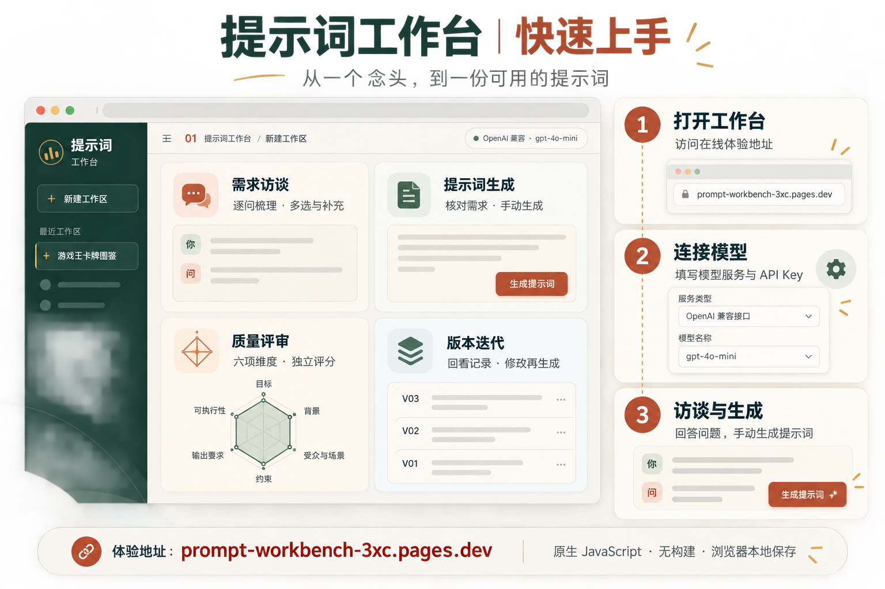
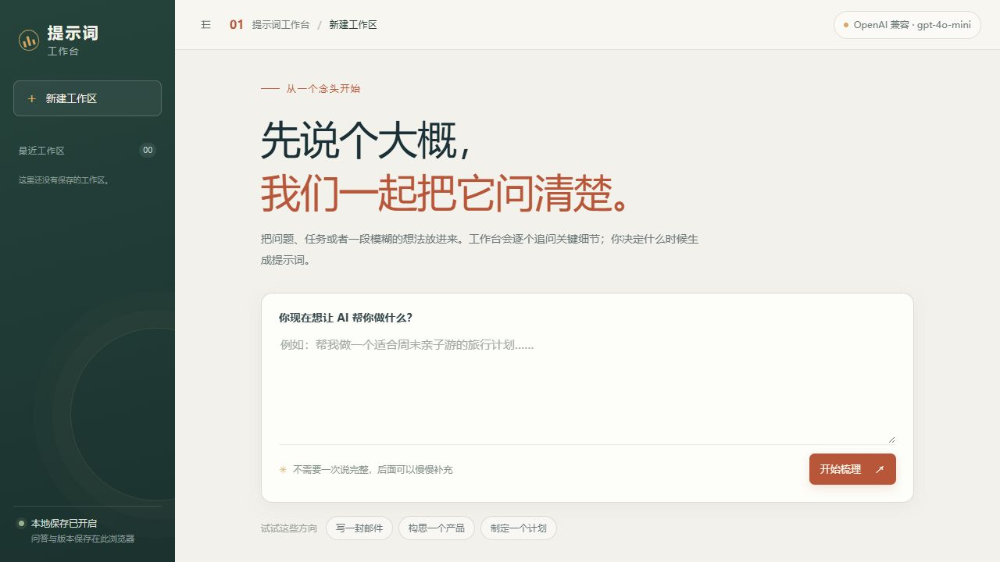
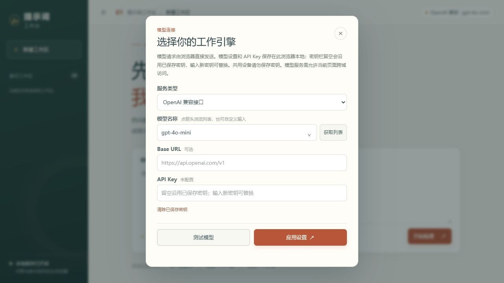
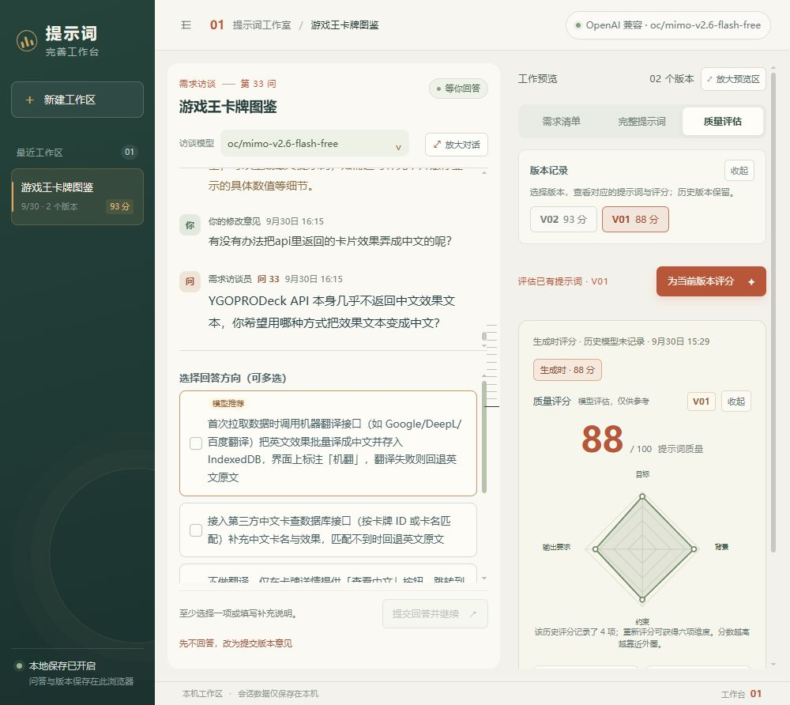

<div align="center">

# Prompt Workbench · 提示词工作台

**把模糊的想法问清楚，再整理成可用的提示词。**

原生 JavaScript · 无框架 · 无构建 · 浏览器本地保存

**[🚀 在线体验](https://prompt-workbench-3xc.pages.dev/)** · **[💻 源码仓库](https://github.com/blackteaYES/prompt-workbench)** · **[💬 问题反馈](https://github.com/blackteaYES/prompt-workbench/issues)**



</div>

---

## 简介

Prompt Workbench 将**需求访谈、提示词生成、质量评审和版本迭代**放在一个浏览器工作区中。先输入一个想法，由模型逐问补齐细节；你核对需求后手动生成提示词，再按需要评分、修改和生成下一版。

适合写作、产品构思、开发任务和计划制定等需要明确目标、背景、约束与交付要求的场景。项目使用原生 HTML、CSS 和 JavaScript，没有 Python 后端，不需要安装前端依赖。

## ✨ 功能特性

| 模块 | 能力 |
|---|---|
| 💬 需求访谈 | 每轮处理一个问题，选项支持多选和补充文字；保留当时选项，可返回修改历史回答 |
| 📋 需求清单 | 已回答、待回答筛选；摘要与完整内容按需展开，点击问题同步定位左侧对话 |
| ✍️ 提示词生成 | 核对需求后手动触发，确认生成模型和是否一起评分；支持预览、Markdown 和复制 |
| 📊 质量评审 | 六项维度与雷达图；可换模型独立评审，评分记录保留模型、时间和改进建议 |
| 🗂️ 版本迭代 | 先选择版本，再查看正文与评分；继续访谈或提交版本意见后生成新版本 |
| 🔌 模型连接 | OpenAI 兼容服务、Ollama；访谈、生成与评审可分别选择模型，支持搜索与自定义名称 |

阅读与操作体验：侧栏可收起，对话与预览可放大；评分、版本记录和反馈可折叠。选项与补充说明共用滚动区域，空回答不能提交；加载、切换和展开有动态反馈，并尊重系统的减少动态效果设置。

## 📸 使用界面

### 从一个念头开始

输入初始想法，开始逐问完善需求；核对访谈记录后，手动生成提示词。



### 连接模型服务

选择 OpenAI 兼容服务或 Ollama，填写模型和连接参数，测试后应用设置。截图中未配置任何 API Key。



### 选择版本与查看评审

提示词与评估页先选择版本，再查看对应内容。截图中的四项图表属于历史评分；新评审使用六项维度，不补造历史分数。



> 顶部总介绍图为 AI 生成的功能示意，下方使用界面图片为真实截图；评分图中的示例记录和分数不代表实际模型效果。

## 🚀 快速开始

### 1. 打开工作台

**在线体验（推荐）**：访问 <https://prompt-workbench-3xc.pages.dev/>。

**本地运行**：克隆仓库，用静态服务器提供仓库根目录：

```powershell
git clone https://github.com/blackteaYES/prompt-workbench.git
cd prompt-workbench
python -m http.server 8001 --bind 127.0.0.1
```

访问 <http://127.0.0.1:8001>。Python 在这里仅提供静态文件，不是应用后端；也可以使用其他静态服务器。可直接打开 `index.html`，但推荐 HTTP(S)，部分模型服务不接受 `file://` 的来源。

### 2. 连接模型

点击右上角模型名称，选择 OpenAI 兼容接口或 Ollama，填写 Base URL、模型名称和 API Key（如服务需要），再使用连接测试。支持获取模型列表和手动输入模型名称。

访谈、生成与评审模型可分别选择，默认跟随连接设置。生成和评分操作通过确认弹窗选择本次模型；可先仅生成提示词，再用其他模型独立评分。

### 3. 回答问题，生成提示词

1. 输入想法，开始需求访谈。
2. 选择回答方向、补充文字；需要时返回修改已有回答。
3. 在需求清单中核对内容，点击“生成提示词”并确认设置。
4. 查看、复制提示词；按需独立评分或提交版本意见，继续完善。

生成始终由你手动触发。已有版本覆盖当前需求时，需新增回答、反馈或切换生成模型才能生成下一版；访谈员判断信息充分时，界面会提供对应生成入口。

## 🌐 Cloudflare Pages 部署

参考 [Agnes-工作台](https://github.com/blackteaYES/agnes-workbench) 的静态部署方式，本项目以仓库根目录的 `index.html` 为入口，发布目录为 `.`。

在 Cloudflare 的 **Workers & Pages → 创建应用 → Pages** 中导入本仓库：

| 配置项 | 值 |
|---|---|
| 生产分支 | `main` |
| 框架预设 | `None` |
| 构建命令 | `exit 0` |
| 构建输出目录 | `.` |
| 根目录 | 留空，使用仓库根目录 |
| 环境变量 | 无需配置模型密钥 |

现有 Cloudflare Pages 项目需要在构建配置中将输出目录从 `static` 改为 `.`，根目录保持仓库根目录；保存后重新部署。构建命令继续使用 `exit 0`，生产分支继续使用 `main`。

连接 GitHub 后，推送生产分支会触发部署。根目录 `index.html` 通过相对路径加载 `assets/js/` 和 `assets/css/`；`docs/images/` 是文档图片，应用运行不依赖这些图片。也可使用其他静态 HTTP(S) 托管服务。

## 🔌 模型服务与跨域

模型请求由浏览器直接发送到用户配置的服务。OpenAI 兼容服务需允许网页来源、`GET` / `POST` / `OPTIONS`，以及 `Authorization` 和 `Content-Type` 请求头。

线上部署时允许来源 `https://prompt-workbench-3xc.pages.dev`；本地调试时允许 `http://127.0.0.1:8001`。自定义域名或端口变化后，应同步修改模型服务的 CORS 配置。线上建议使用 HTTPS 模型接口。

Ollama 需通过 `OLLAMA_ORIGINS` 允许实际网页来源。网页访问本机 Ollama 时，还取决于浏览器的本地网络访问策略和权限；遇到限制可使用本地静态服务器打开工作台。

Cloudflare 只托管网页，不会代转模型请求；配置网页响应头不能替模型服务解决跨域问题。

## 📊 六项质量评分

| 维度 | 关注内容 |
|---|---|
| 目标清晰度 | 要完成什么任务，目标是否具体 |
| 背景完整度 | 必要背景、对象与资料是否齐全 |
| 受众与场景适配度 | 是否符合使用者和使用场景 |
| 约束覆盖度 | 范围、边界和限制是否写明 |
| 输出要求明确度 | 格式、语气、长度等交付要求是否清楚 |
| 可执行性与验收标准 | 步骤是否可执行，结果是否便于检查 |

评分为模型参考评估，不保证最终结果正确。仅生成提示词的版本显示“待评分”；独立评审追加记录，不覆盖正文或原始评分。历史版本按保存时的维度显示，旧四项评分可通过重新评审得到新的六项记录。

## 💾 本地数据与密钥

- 会话、回答、反馈、版本和模型设置保存在当前浏览器的 IndexedDB 中，不可用时尝试本地存储。
- API Key 也保存在浏览器本地，输入框留空沿用已保存密钥；可在模型设置中清除，页面不显示已保存密钥原文。
- 本地数据未加密，共用设备请勿保存密钥；模型调用会将提示内容与对应密钥发送到所配置的服务。
- 浏览器与网页来源不同，数据彼此独立；从 localhost 换到在线域名不会自动迁移原记录。清除站点数据会删除记录。
- 数据不会自动同步到 GitHub 或 Cloudflare。不要将个人配置、密钥或浏览器数据提交到仓库。

## 📁 项目结构

```text
prompt-workbench/
├── index.html              # 根目录页面入口
├── assets/
│   ├── css/
│   │   └── styles.css      # 布局、样式与动效
│   └── js/
│       ├── browser-api.js # 浏览器持久化与模型调用
│       └── app.js         # 界面交互与工作区流程
├── docs/
│   ├── images/            # README 介绍图片与真实界面截图
│   └── imagegen/          # 总介绍图生成提示词
├── AGENTS.md              # 仓库协作规范
└── README.md              # 使用与部署说明
```

本仓库仅包含主应用，不包含独立的 `demo/` 原型、数据库或 Python 后端。

## 🤝 协作与反馈

默认分支为 `main`，代码约定见 [AGENTS.md](AGENTS.md)。贡献者使用自己的提交身份，仅通过 `git config --local` 调整当前仓库配置；提交说明简短并限定修改范围。界面变更请说明检查步骤，附上相应截图。

- [在线体验](https://prompt-workbench-3xc.pages.dev/)
- [问题反馈与功能建议](https://github.com/blackteaYES/prompt-workbench/issues)
- [参考项目：Agnes-工作台](https://github.com/blackteaYES/agnes-workbench)
